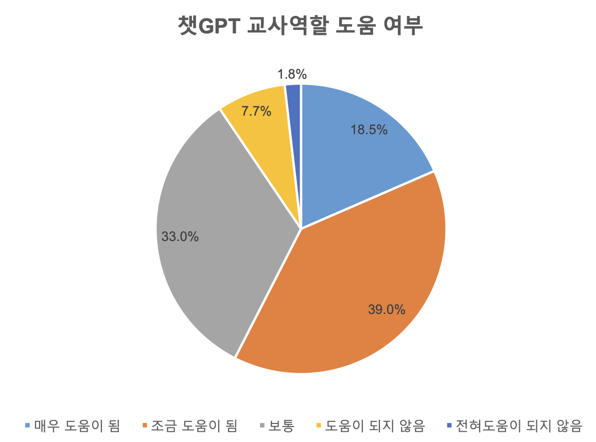

:::    연구계획서

<grid drag="100 50" drop="0 20">

## 국내 ChatGPT의 교육적 활용 연구 동향 분석   :  활동이론을 중심으로

</grid>

<grid drag="100 95" drop="0 40">

한국교원대학교 컴퓨터교육학과  석사과정 정솔

</grid>

---

## 1. 서론
---
### 1.1. 연구의 필요성
#### 1.1.1. 생성형 AI시대와 ChatGPT

---

Katharina Buchholz(2023), Threads Shoots Past One Million User Mark at Lightning Speed,  Statista, https://www.statista.com/chart/29174/time-to-one-million-users/ , notta.ai에서 재인용
<!-- element class="src" -->

---
<!-- slide bg="#000000" -->

---
<!-- slide bg="#000000" -->
 

---
<grid drag="100" drop="0 15">
#### 1.1.2. ChatGPT 활용 교육에 대한 관심 대두 
</grid>

<grid drag="50" drop="0 27">

* 국내 ChatGPT 인식 및 이용률 조사 결과 20-50대 성인의 54.5%가 실제 사용 경험이 있음<!-- element pad="10px" -->  (한국저작권위원회, 2023)
 * 특히 교원의 경우 사용경험여부가 70%에 이르며 사회의 평균보다 높은 관심을 보임.<!-- element pad="10px" -->  (서울특별시교육청, 2023)
* 90%의 교사는 챗GPT가 교사역할에 도움이 된다고 생각하였으며 활용되기 원하는 분야에 대한 중복 조사 결과 교수-학습활동이라고 답한 비율이 80.3%였음.  (서울특별시교육청, 2023)

 </grid>
 
 <grid drop="50 0">
 

</grid>

---

* ChatGPT교육 연수 참여 희망 여부를 묻는 조사에서 88.7%의 교원이 '예'로 응답하였으며 희망 주제에 관한 자유응답에서 '활용'과 '방법'이 가장 많은 빈도로 나타남.  <!-- element  pad="20px"-->(강혜경 외, 2023)

---
### 1.2. 연구 문제
- 활동이론으로 분석한 ChatGTP의 교육적 활용에 관한 국내 연구 동향은 어떠한가?  <!-- element style="font-size:32px" pad="20px"-->
- 연구 동향 분석을 통해 도출할 수 있는 ChatGPT 활용 교육에 관한 시사점은 무엇인가? <!-- element style="font-size:32px" pad="10px"-->

---
## 2. 이론적 배경
### 2.1. 인공지능 LLM과 ChatGPT

출처 : OpenAI blog https://openai.com/blog
### 2.2. ChatGPT의 교육적 활용
#### 2.2.1. 연구 동향을 분석한 선행 연구
#### 2.2.2. 교육분야에서의 주요 기능을 분석한 선행 연구
### 2.3. 활동이론
#### 2.2.1. 활동이론의 개념
#### 2.2.2. 분석의 틀로 사용한 연구 동향
## 3. 연구 방법
### 3.1. 자료수집
### 3.2. 자료분석