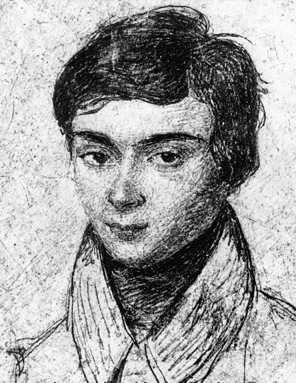

<grid drag="100 3" drop="0 5" bg="#555555">
기말과제<!-- element style="font-size:13pt;color:white;margin-top:30px"pad="10px" -->
</grid>

<grid drag="100 50" drop="0 20">
## 인공지능으로<!-- element style="margin-left:230px"-->
# 20세에 요절한 천재 수학자 구하기
</grid>
<grid drag="100 5" drop="0 70" >

컴퓨터교육과 정솔  
2024.06.05(수)

</grid>

---

<grid drag="100 20" drop="0 5">
## 에바리스트 갈루아(1811 ~ 1832)
</grid>

<grid drag="46" drop="4 20" >

</grid>

<grid drag="46" drop="50 20" >
* 프랑스의 사회운동가이자 수학자
*  권총을 사용한 결투 끝에 사망
	* 사랑하는 연인 설
	* 정치적인 원인 설
	* "스물에 죽으려면 엄청난 용기가 필요하단다."
* 5차 방정식의 근의 공식이 존재하지 않음을 증명
  

</grid>

---

## 1단계 : 문제점 찾기

<!-- element style="margin-left:350px;"-->
### 일생

1. **초기 생애**:
    - 갈루아는 프랑스의 부유한 가정에서 태어났으며, 어린 시절부터 뛰어난 수학적 재능을 보였습니다.
    - 1823년에 파리의 리세 루이 르 그랑(Lycée Louis-le-Grand) 학교에 입학하여 공부를 시작했습니다.
2. **교육과 수학 연구**:
    - 학교에서 그는 특히 수학에 큰 관심을 보였으며, 독학으로 수학을 연구했습니다.
    - 17세 때, 갈루아는 프랑스 과학 아카데미에 **논문을 제출했으나 이해받지 못했습니다.**
---

<grid drag="100 20" drop="0 5">
## 
<!-- element style="margin-left:250px;"-->
</grid>

<grid drag="46" drop="4 30" >
1. **혁신적인 아이디어의 복잡성**
    갈루아의 이론은 그 당시의 수학적 이해를 크게 벗어나는 혁신적인 내용을 담고 있어 이를 이해하려면 기존의 수학적 사고를 크게 확장해야 했습니다.
2. **논문의 서술 방식** 갈루아의 논문은 서술이 명료하지 않고 구조가 잘 잡혀 있지 않았다는 평가를 받습니다. </src>
3. **통신의 한계**  갈루아의 논문이 좀 더 넓은 학문적 커뮤니티의 검토를 받지 못한 것도 이해받지 못한 원인 중 하나일 수 있습니다.</src>
</grid>

<grid drag="46 100" drop="50">

</grid>

---

## 2단계 : 문제 해결하기

<!-- element style="margin-left:300px;"-->

#### 1. 실시간 피드백 및 수정 제안과 시각화 도구

AI 기반의 피드백 시스템을 통해 수학적 오류를 지적하고, 더 나은 수학적 표현을 제안하며 복잡한 이론을 시각적으로 표현함으로써, 그의 이론을 더 쉽게 이해할 수 있도록 도왔을 것입니다.
#### 2. 논문의 명료화와 구조화

인공지능은 갈루아의 논문을 분석하여 더 명료하고 이해하기 쉬운 구조로 재편할 수 있었을 것입니다. AI가 논문의 전반적인 이해도를 향상시키는 데 기여할 수 있습니다.

#### 3. 폭넓은 학술 커뮤니티와의 연결

인공지능은 갈루아가 전 세계의 다른 수학자들과 소통하고 협력할 수 있도록 도왔을 것입니다. 이를 통해 그의 이론을 더 많은 전문가들에게 노출시키고, 다양한 피드백과 제안을 수집할 기회를 제공함으로써, 갈루아의 논문이 더 폭넓게 인정받는 계기를 마련할 수 있었을 것입니다.

---

<split even gap=0.1>

</split>

---

<grid drag="100 20" drop="0 5">
## 3단계 : 문제 해결 후
</grid>

<grid drag="46" drop="4 20" >

</grid>

<grid drag="46" drop="50 20" >

</grid>

* 갈루아가 그의 연구를 지속할 수 있었다면 천재적인 직관과 혁신적인 사고는 수많은 수학적 이론의 기초가  되었을 것이며, 이는 현대 과학과 기술의 발전에도 큰 영향을 미쳤을 것입니다. <!-- element style="margin-top:350px"-->
* 갈루아의 이론은 수학 교육 과정에 포함되어 한국의 고등학생들은 가우스와 함께 갈루아가 없었다면  어땠을까를 매일 상상하며 더 많은 수학 학습을 감당하였을 것입니다. 

---
# 감사합니다.