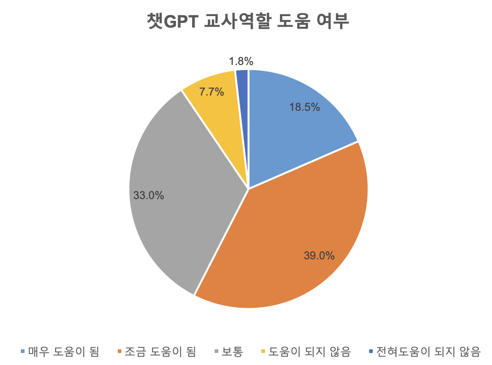
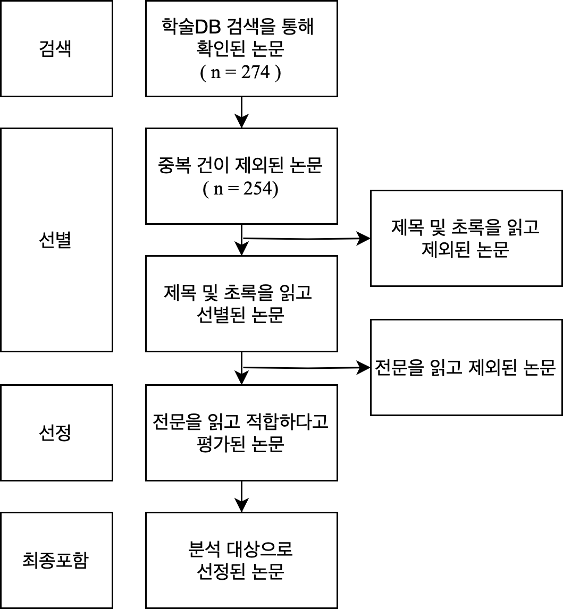

<grid drag="100 3" drop="0 5" bg="#555555">
연구계획서
<!-- element style="font-size:10pt;color:white;"pad="10px" -->
</grid>

<grid drag="100 50" drop="0 20">

# ChatGPT의 중등 교과교육 활용 관련 국내 연구 동향 분석

</grid>

<grid drag="100 95" drop="0 40">

한국교원대학교 컴퓨터교육학과  석사과정 정솔
<!-- element style="text-align:center; align-self:center"-->

</grid>

---

# 목  차 <!-- element style=" margin-top:-500px; margin-left:-500px" -->

<grid drag="60 100" drop="40 0">
- [1. 서론](/vault_cs/export/rp2401/#/2)
  - [1.1. 연구의 필요성](/vault_cs/export/rp2401/#/2)
    - [1.1.1. 생성형 AI시대와 ChatGPT](/vault_cs/export/rp2401/#/2)
    - [1.1.2. 중등교원의 ChatGPT 활용 교육에 대한 관심 대두](/vault_cs/export/rp2401/#/3)
    - [1.1.3. ChatGPT 교육적 활용의 효과를 보고하는 문헌 증가](/vault_cs/export/rp2401/#/4)
  - [1.2. 연구 문제](/vault_cs/export/rp2401/#/5)
- [2. 이론적 배경](/vault_cs/export/rp2401/#/6)
  - [2.1. 생성형 자연어 처리 AI와  ChatGPT](/vault_cs/export/rp2401/#/6)
  - [2.2. ChatGPT의 교육적 활용 관련 선행 연구](/vault_cs/export/rp2401/#/7)
    - [2.2.1. ChatGPT의 교육적 활용 동향을 분석한 선행 연구](/vault_cs/export/rp2401/#/8)
    - [2.2.2. 교육분야에서 주요 기능을 분석한 선행 연구](/vault_cs/export/rp2401/#/9)
- [3. 연구 방법](/vault_cs/export/rp2401/#/10)
  - [3.1. 분석대상 및 자료수집](/vault_cs/export/rp2401/#/11)
  - [3.2. 자료분석](/vault_cs/export/rp2401/#/12)
    - [3.2.1. 활동체제모형 기반 체계적 문헌분석](/vault_cs/export/rp2401/#/11)
    - [3.2.2. 텍스트마이닝](/vault_cs/export/rp2401/#/12)
</grid>

---

<grid drag="46 100" drop="0 5">
## 1. 서론
### 1.1. 연구의 필요성
#### 1.1.1. 생성형 AI시대와 ChatGPT
* 2022년 11월 30일 OpenAI사에서 발표한 ChatGPT는 사용자가 두 달만에 약 1억명을  돌파하며 급속한 파급력을 보임   (Krystal Hu, 2022)
* ChatGPT 발표 이후 생성형 AI기술이 과거의 어떤 신기술 보다 급속한 파급력을 보이며 산업 전반에서 생성형 AI의 활용 가능성을 모색하는 논의가 뜨겁게 이어지고 있음   (Niccolo Conte, 2024)
</grid>

<grid drag="46 100" drop="40 5" >

</grid>

---

<grid drag="100" drop="0 15">
#### 1.1.2. 중등교원의 ChatGPT 활용 교육에 대한 관심 대두 
</grid>

<grid drag="50" drop="0 27">

* 국내 ChatGPT 인식 및 이용률 조사 결과 20-50대 성인의 54.5%가 실제 사용 경험이 있는 가운데 (한국저작권위원회, 2023) 교원의 경우 사용경험여부가 70%에 이르며 사회적 평균보다 높은 관심을 보임 (서울특별시교육청, 2023) 
 * 90%의 교사는 ChatGPT가 교사역할에 도움이 된다고 생각하였으며 활용되기 원하는 분야에 대한 중복 조사 결과 교수-학습활동이라고 답한 비율이 80.3%였음 (서울특별시교육청, 2023)
 *  ChatGPT교육 연수 참여 희망 여부를 묻는 조사에서 88.7%의 교원이 '예'로 응답하였으며 희망 주제에 관한 자유응답에서 '활용'과 '방법'이 가장 많은 빈도로 나타남(강혜경 외, 2023)
 </grid>
 
 <grid drop="50 -6">
 

 서울시교육청(2023). 챗GPT관련 교원 인식 설문조사.  서울교육포럼 :챗GPT시대, 현장교사에게 묻다 자료집</src>
</grid>
---
#### 1.1.3. ChatGPT 교육적 활용의 효과를 보고하는 문헌 증가

* ChatGPT는 작문, 교수법, 교육학 등 여러 측면에 영향을 미치며 의도와 맥락에 따른 개인화된 피드백을 제공하며 빠르고 일관적인 상호운용성 가지는 등 매우 긍정적인 기능을 하므로 ChatGPT를 비롯한 AI 교육은 미래 교육의 논의에서 필수적임(Javaid et al, 2023)

* 2022.12. - 2023.05. 국내와 국외 학술DB(Scopus, Web of Science, KCI, RISS)에서 검색된 ChatGPT와 교육 관련 학술논문의 수가 150편이었던것(장예지 외, 2023)에 비해 최근 1년간의 학술논문 수는 국내 한정으로도 (KCI, RISS, DBPIA) 300여편에 이름

::: block
**$\phantom{----}\rightarrow$ 최근 연구 동향을 살펴보고 중등 교과교육 활용 관련 시사점을 도출하는 연구가 필요함$\phantom{---}$**
:::<!-- element style="margin-top:5%;font-size:27px;color:black;"bg="#f1f1f1f1" width="1200"-->

---
### 1.2. 연구 문제
1.  ChatGPT의 중등 교과교육 활용 관련 국내 문헌의 연구 동향은 어떠한가?  <!-- element style="font-size:30px"-->
2. ChatGPT의 중등 교과교육 활용 관련 국내 문헌의 주요 키워드와 연구주제는 무엇인가?<!-- element style="font-size:30px"-->
3. 연구 동향 분석을 통해 도출할 수 있는 ChatGPT의 중등 교과교육 활용에 관한 시사점은 무엇인가? <!-- element style="font-size:30px" -->

---

<grid drag="100 20" drop="0 5">
## 2. 이론적 배경
</grid>

<grid drag="46" drop="0 20" >
### 2.1. 생성형 자연어 처리 AI와  ChatGPT
* 생성형 자연어 처리 인공지능 모델 : 입력한 데이터를 이용하여 텍스트를 생성하는 기술
* 텍스트 학습시 전처리(토큰화, 임베딩) 후 딥러닝 기반 자연어 처리 모델인 트랜스포머(transformer)를 통해 인코딩(상호 관계 학습)과 디코딩(생성)
* GPT(Generative pre-trained transformer) : 트랜스포머를 활용하는 대규모 언어 생성 모델 중 하나로서 확률을 기반으로 텍스트를 생성할 수 있도록 사전 학습된 생성형 AI
* ChatGPT : GPT를 기반으로 인간과 상호작용을 할 수 있는 프롬프터를 제공하는 응용프로그램
</grid>

<grid drag="46" drop="50 20" >

OpenAI blog https://openai.com/blog 

</grid>

---

### 2.2. ChatGPT의 교육적 활용 관련 선행 연구

* 교육에서 AI의 활용은 AIED(Artificial Intelligence in Education)이라고 불리며  'AI에 대한 교육'과  'AI를 활용한 교육'로 나뉘어 제시(Holmes et al., 2019)된 이래로 활발하게 연구되어오고 있음

* ChatGPT의 교육적 활용 관련 주요 연구주제

	* 각 교과의 문제해결에서 ChatGPT의 성능 평가 (Greeling et al, 2023; Frieder et al, 2023; 권오남 외, 2023; Wardat et al, 2023; Kung et al, 2023; Opne AI, 2023)
	* 교수$\cdot$학습 상황에서 ChatGPT의 활용 방안  (Al-Worafi et al., 2023; Kanneci et al., 2023; 강동훈, 2023; 이수환. 송기환, 2023; Yan, 2023; 유재진, 2023; 윤양인, 2023)
	* 개별학습 상황에서 ChatGPT의 튜터 또는 피드백 제공자로의 활용 방안 (Rudolph et al, 2023; Molick et al, 2023; Kasneci et al, 2023)
	* ChatGPT 활용시 제기되는 우려사항 및 제한점 (C. Lo, 2023; van Dis et al 2023; Tlili et al, 2023)

---
#### 2.2.1. ChatGPT의 교육적 활용 동향을 분석한 선행 연구

*  최나래. 김미량(2023)
	* 2022.12. - 2023.07.에 발행된 39편의 국내 학술논문 대상<!-- element style="margin-top:-10px" -->
	- 핵심 키워드(워드클라우드)를 통해 연구동향 분석
 
* 장혜지. 소효정(2023)
	* 2022.12. - 2023.05.에 발행된 72편의 관련 문헌의 초록 대상 (국내: 14, 국외: 58)<!-- element style="margin-top:-10px" -->
	- 체계적 문헌분석 (발표 시기, 연구유형, 대상 학교급, 연구 분야) 
	- 텍스트 마이닝 기법을 활용한 토픽 분석 실시

* Fütterer et al.(2023) 
	* ChatGPT 출시(2022.11.30)이후 2달 간의 트위터 데이터* 대상<!-- element style="margin-top:-10px" -->  (*5,541,457명의 사용자로부터 16,830,997건의 트윗)
	* 토픽 모델링과 감성분석을 기반으로 교육 분야에서의 ChatGPT에 대한 전 세계의 인식과 반응 분석

---

<grid drag="85 100" drop="0 0">
#### 2.2.2. 교육분야에서 주요 기능을 분석한 선행 연구 
* M. Javaid, A. Haleem, R.P. Singh et al.  (2023)
	* ChatGPT의 교육적 활용의 필요성 분석<!-- element style="margin-top:10px" -->
	* ChatGPT의 주요 기능과 주요 적용 사례 제시
	* 주요 기능  대규모 데이터 처리,  협력적 예측,  실습 세션,  실시간 교육  지원,  사례 연구 기반 교육, 가상 보조,  후속 조치,  작업 기억,   상호작용 교수 학습,  기록 백업
	* 주요 적용 사례 비판적 사고와 소통 능력 향상, 학습 자료 생성, 학생의 대화상대, 읽기 및 이해 능력 향상, 가상 교육 어시스턴트, 질문 능력 향상, 복합 문제 이해, 직접적 질의 응답, 브레인스토밍, 맞춤형 학습, 텍스트 분석, 에세이 작성, 학습 환경 향상, 언어 이해, 시험 준비 촉진, 정보 검색, 교수 설계 보조, 연구 도구, 문서 요약, 학업 능력 평가, 자동 채점, E-Learning, 상호작용 경험, 온라인 학습 지원, 지식 향상
</grid>

<grid drag="46 40" drop="50 22" >

</grid>

Javaid et al. (2023). Unlocking the opportunities through ChatGPT Tool towards ameliorating  the education system. BenchCouncil Transactions on Benchmarks, Standards and Evaluations, 3(2). 

<!-- element style="margin-top:55%" -->

---

<grid drag="42 100" drop="0 5">

## 3. 연구 방법
### 3.1. 분석대상 및 자료수집
* 분석 대상 : ChatGPT 중등 교과교육 활용 관련 2023. 05 - 2024. 04. 발행 KCI 학술논문 
* 자료 수집
	* 검색어 : GPT + 교육
	* 검색일 : 2024. 05. 01.
	* 학술DB : KCI, RISS
* PRISMA 절차에 따른 선별
	* 고등교육 대상 또는 개별학습 및 교수지원(수업설계 등)에 해당하는 논문 제외 예정

</grid>

<grid drag="46 90" drop="50 10" >

</grid>

---

<grid drag="46 100" drop="0 5">
### 3.2. 자료분석

#### 3.2.1. 활동체제모형 기반 체계적 문헌분석
* 2세대 활동체제모형 (조영환 외, 2015; 김민지 외, 2021)
	* 문화 역사적 관점에서 인간의 활동을 체제적으로 설명하는 활동이론 기반
	* 활동요소 : 주체, 객체, 도구, 공동체, 규칙, 분업
	* 활동요소 간 상호작용의 체계적 분석 가능
* 분석 틀 
	* 김민지 외(2021)에서 인공지능 챗봇의 교육적 활용 연구 동향 분석을 위해 사용한 틀을 ChatGPT의 활용에 맞게 수정
	* 매개물로서 ChatGPT의 역할을 Javaid(2023)에서 제시된 주요 사례를 통해 다양화 및 구체화
</grid>

<grid drag="46 100" drop="50 5" >

| **활동요소** |**구분**     | **하위요소**                         |
|------|---------|------------------------------|
| 주체   | 학교급     | 초등학교, 중학교, 고등학교              |
|      | 표집 크기   | 15명 미만, 15 ~ 30명, 30명 초과     |
| 매개물  | 역할      | 의사소통 상대, 학습자료 제공, 교육 어시스턴트   |
|      |         | 데이터 처리도구, 에세이 작성 보조, 정보 검색 등 |
| 객체   | 학습영역    | 언어정보, 지적기능, 운동기능, 인지전략, 태도   |
|      | 교과목     | 국어, 수학, 영어, 사회, 과학, 제2외국어    |
| 결과   | 학습결과    | 인지, 정의, 인지 및 정의              |
| 규칙   | 사용 횟수   | 0회, 1회, 2회 이상                |
|      | 통제      | 스캐폴딩 제공, 학습자가 통제, 모두         |
| 공동체  | 학습환경    | 온라인, 오프라인, 블렌디드              |
| 분업   | 팀 구성 유형 | 개별학습, 협동학습                   |

</grid>

---

<grid drag="100 100" drop="0 0">
#### 3.2.2. 텍스트마이닝
* 전처리 : 영문 초록(없는 경우 번역)을 추출하여 python 자연어처리 라이브러리를 통해 데이터 정제
* 가장 많이 언급된 키워드 빈도분석
* LDA*(Latent Dirichlet Allocation) 기반 토픽 모델링을 통해 토픽 추출 및 빈도분석
<!-- element style="margin-top:50px" -->
</grid>
<grid drag="100 30" drop="0 80">
*LDA : 주어진 문서에서 발견된 단어 수 분 포를 분석하여 해당 문서가 어떤 토픽들을 가지고 있을 지 예측하는 텍스트마이닝 분석 기법 (안윤빈 외, 2021)

---

## 참고문헌

An, Y.-B., Kim, H.-Y., Moon, Y.-H., Hwang, S.-Y., & Kim, J.-J. (2021). _LDA 기반 사용자 감정분석을 위한 문서 토픽 추출 시스템에 대한 연구 A Study on the Document Topic Extraction System for LDA-based User Sentiment Analysis_. _21_(2), 2289. https://doi.org/10.7236/JIIBC.2021.21.2.195

Choi, N.-R., & Kim, M.-R. (2023). Chat GPT와 교육, 학술논문 초록 분석을 통한 핵심 키워드와 연구동향 탐구 Education with Chat GPT, Exploration of Keywords and Research Trends through the Analysis of Academic Paper Abstracts 최나래 † ‧ 김미량 † † 성균관대학교 컴퓨터교육과. _2023년 한국컴퓨터교육학회 하계 학술발표논문집 제27권 제2호_, 69–72.

Fütterer, T., Fischer, C., Alekseeva, A., Chen, X., Tate, T., Warschauer, M., & Gerjets, P. (2023). ChatGPT in education: global reactions to AI innovations. _Scientific Reports_, _13_(1). https://doi.org/10.1038/s41598-023-42227-6

Javaid, M., Haleem, A., Singh, R. P., Khan, S., & Khan, I. H. (2023). Unlocking the opportunities through ChatGPT Tool towards ameliorating the education system. _BenchCouncil Transactions on Benchmarks, Standards and Evaluations_, _3_(2). https://doi.org/10.1016/j.tbench.2023.100115

Kim, M., Yeom, J.-Y., Jung, H.-W., & Lim, C. (2021). A Review of Research on Artificial Intelligence Chatbot in Education through the Lens of Activity Theory. _Korean Association for Educational Information and Media_, _27_(2), 699–721. https://doi.org/10.15833/kafeiam.27.2.699

Krystal Hu. ChatGPT sets record for fastest-growing user base - analyst note. Reuters. https://www. reuters.com/technology/chatgpt-sets-record-fastest-growing-user-base-analyst-note-2023-02-01, 2023 (검색일 : 2024 - 04 - 30).

Notta. (n.d.). ChatGPT Statistics. Retrieved May 1, 2024, from https://www.notta.ai/en/blog/chatgpt-statistics

장혜지, & 소효정. (2023). ChatGPT의 교육적 활용 관련 연구동향 및 주제 분석 The Analysis of Research Trends and Topics about the Educational Use of ChatGPT. _Journal of Research in Curriculum & Instruction_, _27_(4), 387. https://doi.org/10.24231/rici.2023.27.4.387
