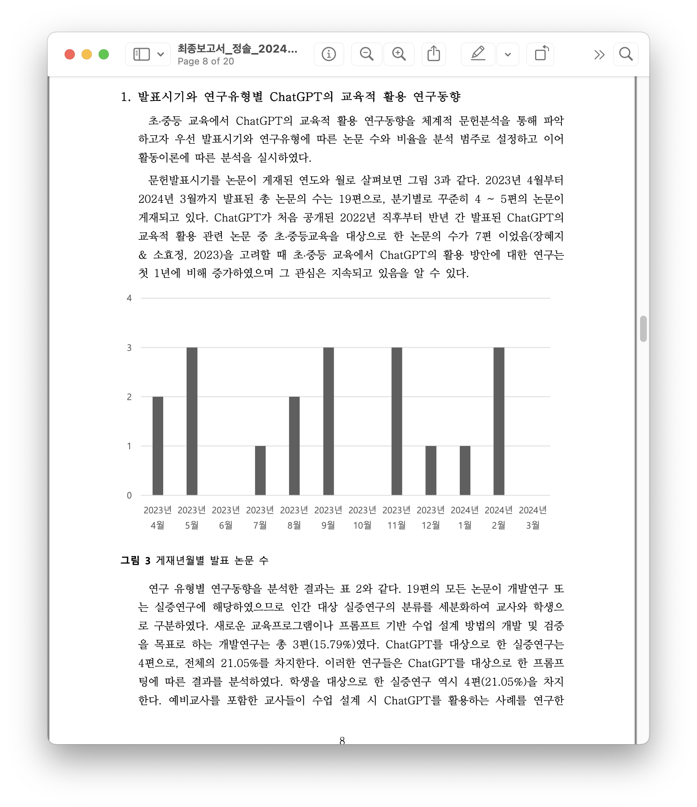
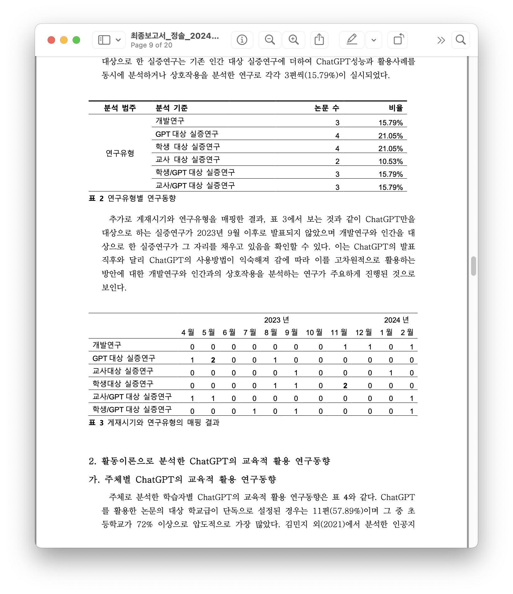
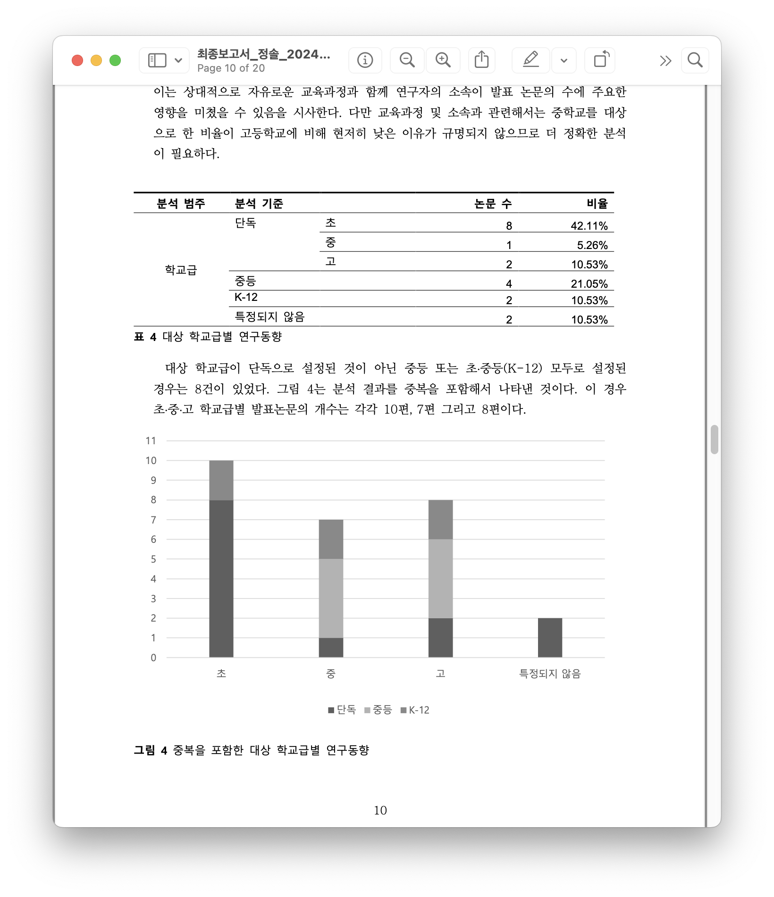
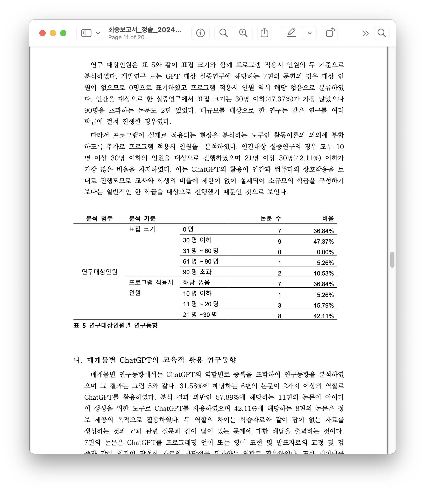
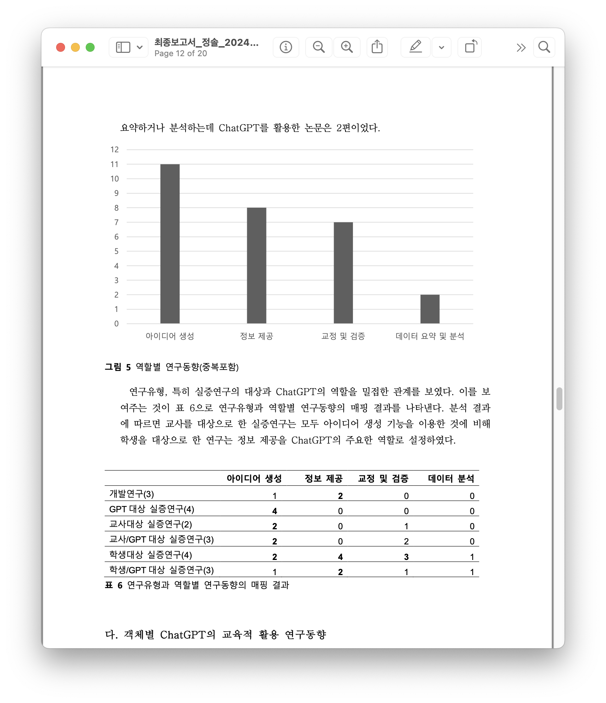
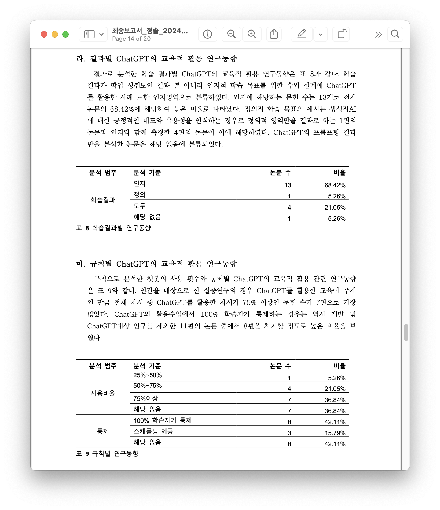
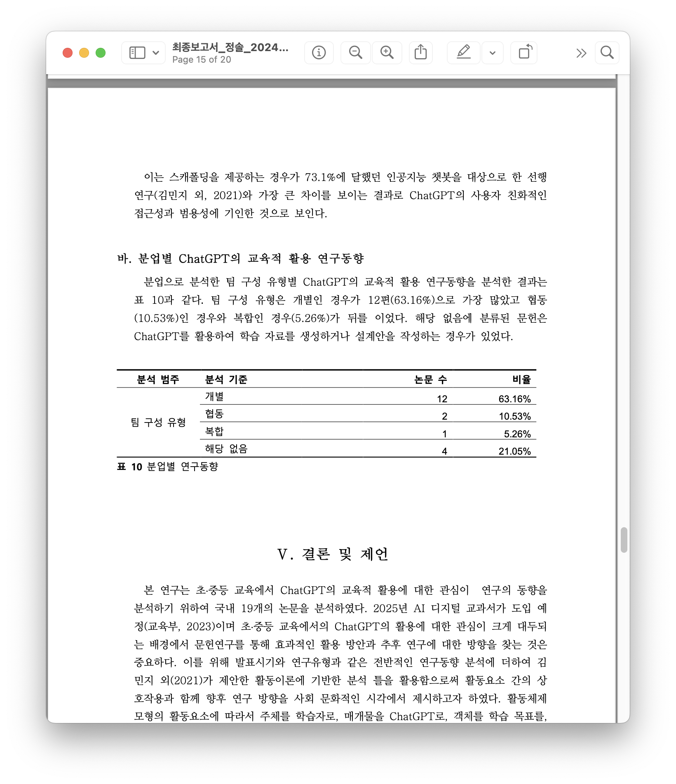

<grid drag="100 3" drop="0 5" bg="#555555">
최종보고서
<!-- element style="font-size:10pt;color:white;"pad="10px" -->
</grid>

<grid drag="100 50" drop="0 20">

# 초$\cdot$중등교육에서의 ChatGPT 활용 관련  국내 연구동향 분석: 활동이론을 중심으로

</grid>

<grid drag="100 95" drop="0 40">

한국교원대학교 컴퓨터교육학과  석사과정 정솔
<!-- element style="text-align:center; align-self:center"-->

</grid>

---

# 목  차 <!-- element style=" margin-top:-500px; margin-left:-500px" -->

<grid drag="60 100" drop="40 0">

|||
|-------------------------------------|----|
| Ⅰ. 서론                               | 4  |
| Ⅱ. 이론적 배경                           | 5  |
| $\quad$1. 생성형 자연어 처리 AI와 ChatGPT           | 5  |
| $\quad$2. ChatGPT의 교육적 활용관련 선행연구와 주요 기능    | 5  |
| $\quad$3. 활동이론 기반 교육 연구                    | 6  |
| Ⅲ. 연구 방법                            | 7  |
| $\quad$1. 분석 대상 및 자료 수집                    | 7  |
| $\quad$2. 자료 분석                            | 8  |
| Ⅳ. 결과 및 논의                          | 11 |
| $\quad$1. 발표시기와 연구유형별 ChatGPT의 교육적 활용 연구동향 | 11 |
| $\quad$2. 활동이론으로 분석한 ChatGPT의 교육적 활용 연구동향  | 12 |
| Ⅴ. 결론 및 제언                          | 18 |
| 참고문헌                                | 21 |
|||

</grid>
---

<grid drag="46 100" drop="5 0">
## Ⅰ. 서론
### 생성형 AI시대와 ChatGPT
* 2022년 11월 30일 OpenAI사에서 발표한 ChatGPT는 사용자가 두 달만에 약 1억명을  돌파하며 급속한 파급력을 보임   (Krystal Hu, 2022)
* ChatGPT 발표 이후 생성형 AI기술이 과거의 어떤 신기술 보다 급속한 파급력을 보이며 산업 전반에서 생성형 AI의 활용 가능성을 모색하는 논의가 뜨겁게 이어지고 있음   (Niccolo Conte, 2024)
</grid>

<grid drag="46 100" drop="46 5" >

</grid>

---

<grid drag="100" drop="0 15">
### 초$\cdot$중등교원의 ChatGPT 활용 교육에 대한 관심 대두 
</grid>

<grid drag="50" drop="0 27">

* 국내 ChatGPT 인식 및 이용률 조사 결과 20-50대 성인의 54.5%가 실제 사용 경험이 있는 가운데 (한국저작권위원회, 2023) 교원의 경우 사용경험여부가 70%에 이르며 사회적 평균보다 높은 관심을 보임 (서울특별시교육청, 2023) 
 * 90%의 교사는 ChatGPT가 교사역할에 도움이 된다고 생각하였으며 활용되기 원하는 분야에 대한 중복 조사 결과 교수-학습활동이라고 답한 비율이 80.3%였음  (서울특별시교육청, 2023)
 *  ChatGPT교육 연수 참여 희망 여부를 묻는 조사에서 88.7%의 교원이 '예'로 응답하였으며 희망 주제에 관한 자유응답에서 '활용'과 '방법'이 가장 많은 빈도로 나타남 (강혜경 외, 2023)
 </grid>
 
 <grid drop="50 0">
 

 서울시교육청(2023). 챗GPT관련 교원 인식 설문조사.  서울교육포럼 :챗GPT시대, 현장교사에게 묻다 자료집</src>
</grid>
---
### ChatGPT의 교육적 활용 관련 연구 동향

* ChatGPT를 활용한 교육 관련 문헌을 살펴보면 기간에 비해 상대적으로 많은 연구가 진행됨

* 축적된 문헌을 토대로 연구동향 분석이 진행됨
	* 최나래 & 김미량 : 22.12. - 23.07.에 발행된 39편의 국내 학술논문 대상 키워드 분석(워드클라우드)
	* 장혜지 & 소효정 : 22.12.- 23.05.에 발행된 72편의 국내외 논문 대상 전반적인 연구동향 (연구 유형, 학교급, 교육내용)과 토픽 및 키워드 분석
* 기존 연구의 경우 전반적인 연구동향과 토픽 및 키워드 분석만을 실시하였으므로 현장에 활용가능한 실천적인 시사점을 도출하기에 충분하지 않음

::: block
$\phantom{-}\rightarrow$ **ChatGPT의 교육적 활용 관련 문헌 중 초•중등교육에 관한 문헌을 선별하여 활동이론에 근거한 체계적 문헌분석을 통해 분석함으로써 교육현장에 적용할 수 있는 실천적인 시사점을 도출하고자 함**
:::<!-- element style="margin-top:1%;font-size:27px;color:black;"bg="#f1f1f1f1" pad="20px"-->

---
### 연구 문제
1.  초•중등교육에서 ChatGPT를 활용한 교육과 관련된 국내 문헌의 전반적인 연구동향은 어떠한가?  <!-- element style="font-size:30px"-->
2. 활동이론으로 분석한 초•중등교육에서의 ChatGPT 활용 관련 국내 연구동향은 어떠한가?<!-- element style="font-size:30px"-->
3. 초•중등교육에서의 ChatGPT 활용 관련 국내 문헌 분석을 기반으로 도출할 수 있는 시사점은 무엇인가? <!-- element style="font-size:30px" -->

---

<grid drag="100 20" drop="0 5">
## Ⅱ. 이론적 배경
</grid>

<grid drag="46" drop="0 20" >
### 1. 생성형 자연어 처리 AI와  ChatGPT
* 생성형 자연어 처리 인공지능 모델 : 입력한 데이터를 이용하여 텍스트를 생성하는 기술
* 텍스트 학습시 전처리(토큰화, 임베딩) 후 딥러닝 기반 자연어 처리 모델인 트랜스포머(transformer)를 통해 인코딩(상호 관계 학습)과 디코딩(생성)
* GPT(Generative pre-trained transformer) : 트랜스포머를 활용하는 대규모 언어 생성 모델 중 하나로서 확률을 기반으로 텍스트를 생성할 수 있도록 사전 학습된 생성형 AI
* ChatGPT : GPT를 기반으로 인간과 상호작용을 할 수 있는 프롬프터를 제공하는 응용프로그램
</grid>

<grid drag="46" drop="50 20" >

OpenAI blog https://openai.com/blog 

</grid>

---

### 2. ChatGPT의 교육적 활용 관련 선행연구와 주요 기능

 #### ChatGPT의 교육적 활용 관련 주요 연구주제

* 각 교과의 문제해결에서 ChatGPT의 성능 평가 (Greeling et al, 2023; Frieder et al, 2023; 권오남 외, 2023; Wardat et al, 2023; Kung et al, 2023; Opne AI, 2023)
* 교수$\cdot$학습 상황에서 ChatGPT의 활용 방안  (Al-Worafi et al., 2023; Kanneci et al., 2023; 강동훈, 2023; 이수환. 송기환, 2023; Yan, 2023; 유재진, 2023; 윤양인, 2023)
* 개별학습 상황에서 ChatGPT의 튜터 또는 피드백 제공자로의 활용 방안 (Rudolph et al, 2023; Molick et al, 2023; Kasneci et al, 2023)
* ChatGPT 활용시 제기되는 우려사항 및 제한점 (C. Lo, 2023; van Dis et al 2023; Tlili et al, 2023)

---

<grid drag="85 100" drop="0 0">
#### 교육분야에서 주요 기능을 분석한 선행 연구 
* M. Javaid, A. Haleem, R.P. Singh et al.  (2023)
	* ChatGPT의 교육적 활용의 필요성 분석<!-- element style="margin-top:10px" -->
	* ChatGPT의 주요 기능과 주요 적용 사례 제시
	* 주요 기능  대규모 데이터 처리,  협력적 예측,  실습 세션,  실시간 교육  지원,  사례 연구 기반 교육, 가상 보조,  후속 조치,  작업 기억,   상호작용 교수 학습,  기록 백업
	* 주요 적용 사례 비판적 사고와 소통 능력 향상, 학습 자료 생성, 학생의 대화상대, 읽기 및 이해 능력 향상, 가상 교육 어시스턴트, 질문 능력 향상, 복합 문제 이해, 직접적 질의 응답, 브레인스토밍, 맞춤형 학습, 텍스트 분석, 에세이 작성, 학습 환경 향상, 언어 이해, 시험 준비 촉진, 정보 검색, 교수 설계 보조, 연구 도구, 문서 요약, 학업 능력 평가, 자동 채점, E-Learning, 상호작용 경험, 온라인 학습 지원, 지식 향상
</grid>

<grid drag="46 40" drop="50 22" >

</grid>

Javaid et al. (2023). Unlocking the opportunities through ChatGPT Tool towards ameliorating  the education system. BenchCouncil Transactions on Benchmarks, Standards and Evaluations, 3(2). 

<!-- element style="margin-top:55%" -->

---

### 3. 활동이론 기반 교육 연구
#### 활동이론
- 사회문화적 맥락에서 인간의 개별적 행위를 이해하기 위한 이론
- 분석 최소 단위 : 활동
- 활동 요소 : 주체(Subject), 객체(Object), 매개체(Mediating artefacts)
- 요소들의 상호작용을 통해 활동 체계의 양상 분석 및 모순 발견 (구유정 외, 2021)  

---

<grid drag="46" drop="0 20" >
#### 2세대 활동이론

- Engestrom(1987)에 의해 제안
- 규칙(Rules), 공동체(Community), 분업(Division of labour)을 추가하여 집단적 학습활동 분석에 적합
- 분석틀로 활발히 사용 (김민지, 2021)  

#### 활동이론의 교육 분야 적용
- 활동이론의 위상이 교육학 내에서 높아지고 있음 (구유정 외, 2021)
- 설명적 도구와 실천적 도구로도 활용 가능
</grid>
<grid drag="40" drop="52 20" >

 Engestrom, 1987, 재인용 : Matbury, 2012

</grid>

---

<grid drag="46 100" drop="0 5">

## Ⅲ. 연구 방법
### 1. 분석대상 및 자료수집
* 분석 대상 : 초•중등 교육에서 ChatGPT 활용 교육관련 2023. 05 - 2024. 04. 발행 KCI 학술논문 
* 자료 수집
	* 검색어 : 'GPT + 교육' or 'GPT+학습'
	* 검색일 : 2024. 05. 01.
	* 학술DB : KCI, RISS, DBPIA
* PRISMA 절차에 따른 선별
	* 366편의 논문 중 최종적으로 19편의 논문 선별
	* 제외 이유 : 분석 기간 미해당, 고등교육, 개별학습

</grid>

<grid drag="46 90" drop="50 10" >

</grid>

---

<grid drag="48 100" drop="0 5">
### 2. 자료분석

#### 활동체제모형 기반 체계적 문헌분석
* 문화 역사적 관점에서 인간의 활동을 체제적으로 설명하는 활동이론 기반
* 2세대 활동이론은 집단학습의 분석틀로 활용하기 적절
* 활동요소 : 주체, 객체, 도구, 공동체, 규칙, 분업
  

#### 분석 범주 와 분석 기준 
* 김민지 외(2021)에서 인공지능 챗봇의 교육적 활용 연구 동향 분석을 위해 사용한 틀을 수정
* 장혜지 외(2023)의 연구에서 사용한 연구 유형 기준 추가
* 주체 요소를 중등학교급에 맞게 재구성
* 매개물로서 ChatGPT의 역할을 Javaid(2023)에서 제시된 주요 사례를 통해 다양화 및 구체화
</grid>

<grid drag="45 100" drop="51 5" >

| 구분                   | 분석 범주   | 분석 기준           |
|----------------------|---------|-----------------|
| 연구동향                 | 발표시기    | 논문게재 연도 및 월     |
|                      | 연구유형    | 개념연구 개념연구 문헌연구 실증연구            
| 주체                   | 대상 학교급  | 초 중  고   
|                      | 연구대상인원  | 표집 크기           |
| 매개물                  | 역할      | 아이디어 생성         |
|                      |         | 정보 제공           |
|                      |         | 교정 및 검증         |
|                      |         | 데이터 요약 및 분석     |
| 객체                   | 교과목     | 교과목             |
| 결과                   | 학습결과    | 인지              |
|                      |         | 정의              |
|                      |         | 모두              |
|                      |         | 해당 없음           |
| 규칙                   | 사용 비율   | 25%~50%         |
|                      |         | 50%~75%         |
|                      |         | 75%이상           |
|                      |         | 해당 없음           |
|                      | 통제      | 100% 학습자가 통제    |
|                      |         | 스캐폴딩 제공         |
|                      |         | 수업 중 활용하지 않음    |
| 분업                   | 팀 구성 유형 | 개별   협동 복합           |
|||

</grid>
---
##  Ⅳ. 결과 및 논의
### $\rightarrow$ 연구보고서 통해 살펴보겠습니다. [링크](atts/final20246523.pdf)
<split gap="1" even>

</split>
<split gap="1" even>

</split>

---

## Ⅴ. 결론 및 제언
### 결론
1. ChatGPT 발표 후 시간이 지남에 따라 체계적인 개발연구와 학생과 교사를 대상으로 하는 실증연구가 증가
2. ChatGPT의 역할은 학교급과 연구대상 및 교과의 영향을 받음
	* 보편적 역할 : 아이디어 생성(57.89%)
	* 초등학생 및 중학생 대상 : 정보 제공
	* 고등학생 및 교사 대상 : 교정 및 검증
	* 언어관련 교과(영어, 프로그래밍)의 학습에서 교정의 기능을 담당하는 경우가 많았음
1. 명시적인 스캐폴딩을 제공하는 활용 연구 수가 적음 (인간 대상 실증연구 11편 중 3편)
	* 교육환경 제약에서 자유롭다는 점에서 긍정적
	* 비목적성 도구 특성상 윤리교육과 결과에 대한 비판적 해석 교육은 필요(이숙연, 2023; 이준 외, 2023)
	* 협동학습을 통한 스캐폴딩 제공 방안에 대한 연구 필요

---

### 한계 및 후속 연구에 대한 제언
1. 분석 대상 논문이 양적으로 충분하지 않음
2. ChatGPT 3 또는 3.5 외의 4.0 및 생성형 AI를 포함한 추가 연구 필요
3. 각 문헌의 맥락을 세부적으로 분석하는 것에는 제한이 있음   

**초중등 교육을 중심으로 ChatGPT 활용 교육의 연구 동향 및 활동요소를 다각적으로 파악했다는 점에서 의의가 있으며   향후 ChatGPT의 교육 연구와 정책의 기초자료로 활용될 수 있을 것으로 예상함**

---
# 감사합니다.