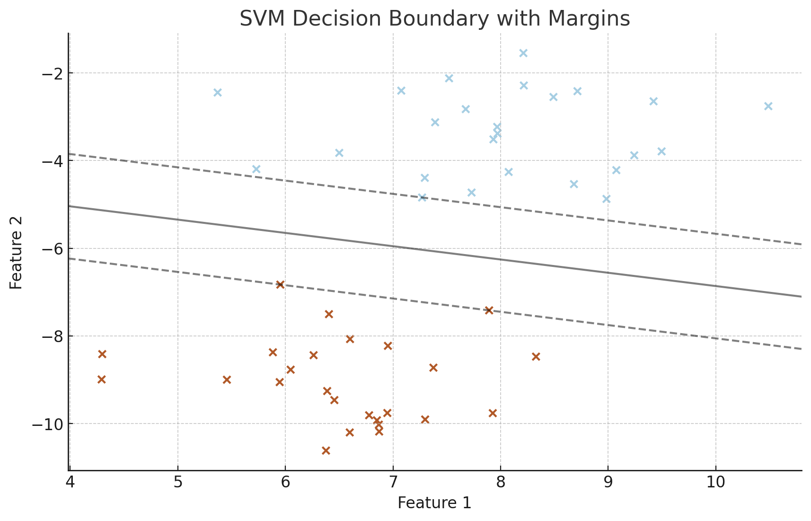
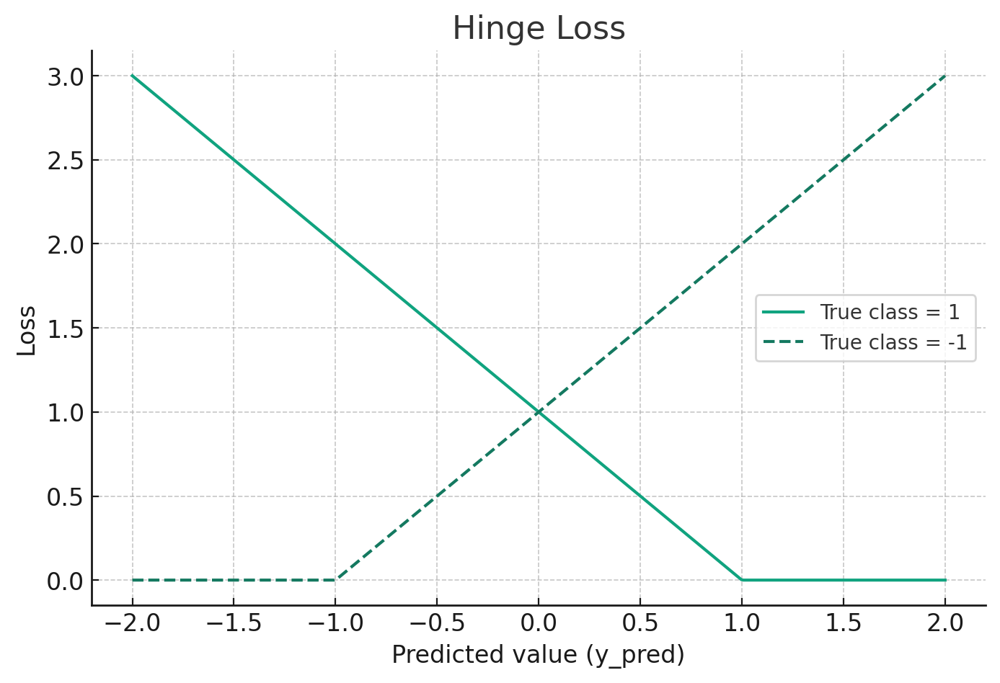
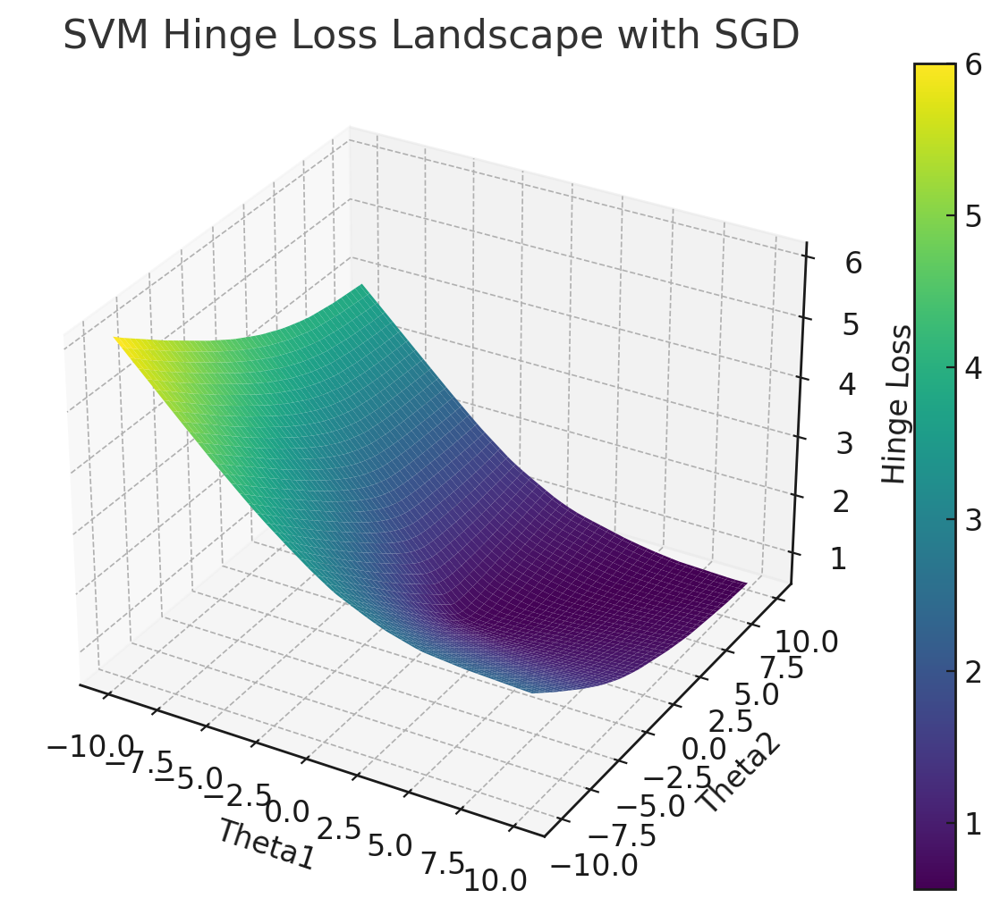

<grid drag="100 3" drop="0 5" bg="#555555">
혼자 공부하는 머신러닝
<!-- element style="font-size:13pt;color:white;"pad="10px" -->
</grid>

<grid drag="100 50" drop="0 20">
# 확률적 경사하강법
</grid>
<grid drag="20 5" drop="45 70" >

2024.04.25. (목)

</grid>

---

## 점진적 학습 <!-- element style="align-self:center" -->

훈련한 기존 모델에 새로운 데이터를 추가하여 모델을 업데이트 하는 방법<br>대표적인 알고리즘 : 경사 하강법 <!-- element style="align-self:center" -->


---

<grid drag="50" drop="0 0">
#### 경사하강법을 이용한 학습 예시
```
input = np.array([2, 4, 6, 8, 10, 12, 14])
output = np.array([3, 5, 7, 9, 11, 13, 15])
```

$MSE = \frac{1}{n}\sum \{y_i​−(ax_i​+b)\} ^2$
$$\phantom{MSE} =  \frac{1}{7}[(3−(a×2+b))^2+(5−(a×4+b))^2+\cdots +$$
$$\phantom{MSEME} + (13−(a×12+b))^2+(15−(a×14+b))^2]$$
$$\phantom{MSE} = 80a^2+16ab−176a+b^2−18b+97$$
<!-- element align="left" style="font-size:22.3px"-->

</grid>

<grid drag = "50 10" drop="55 ">
$MSE_a  = -\frac{2}{n}\sum(y_i-(ax_i+b))x_i$
$$MSE_b = -\frac{2}{n}\sum(y_i-(ax_i+b))$$
```
a, b = 2, 2 # 초기값(출발장소 : 적당히 아무거나)
lr = 0.005 #learning rate (다리길이)
result = [a*i + b for i in input]
error = output - result # (y_i -(ax_i+b))
error = [ -3 -5 -7 -9 -11 -13 -15]
input*error =  [ -6 -20 -42 -72 -110 -156 -210] 
```
$$ a = a - lr*MSE_a$$ <br>
$$b  = b - lr*MSE_b$$
<br>
$a, b$ 값의 변화 : <br>
$(2, 2) \rightarrow(1.56,1.955) \rightarrow (1.30, 1.93)\cdots \rightarrow (0.99,1.123)$


</grid>

---
## 손실 함수 (Loss) : 내려가야할 산
회귀함수와 원래 값의 차이를 계산하는 함수 <br> 연속이고 미분가능해야함<br>예 : MSE (Mean Squared Error), 크로스 엔트로피(Cross-Entropy), 힌지(hinge) 

<split even gap="5">


</split>


source : https://towardsdatascience.com/animations-of-logistic-regression-with-python-31f8c9cb420<!-- element class="src" -->

---

<grid drag="100 20" drop="0 5">
## 이진 크로스 엔트로피 (Binary Cross Entropy)
</grid>

<grid drag="46" drop="0 20" >
$$ \begin{cases} -\log{p} & \text{if }y = 1 \\ -\log(1-p) & \text{if }y = 0 \end{cases} $$<br><br>
$$= -\{y\log{p} + (1-y) \log(1-p) \} $$

$$ CE  = -\frac{1}{n}\sum\{y\log{p} + (1-y) \log(1-p) \} $$

 <!-- element style="align-self:start" -->
</grid>

<grid drag="46" drop="50 20" >
**[Remind]** Linear Regression - MSE
<br>$MSE_a = (-1)\times \rm{mean}(error \times input)$
<br>$MSE_b = (-1)\times \rm{mean}(error) $

**[Discover]** Sigmoid - CE
<br>$CE_a = (-1)\times \rm{mean}(error \times input)$
<br>$CE_b = (-1)\times \rm{mean}(error) $

(증명) https://velog.io/@epsilon/시그모이드-오차함수의-편미분
</grid>

---

## 확률적 경사하강법
하나의 샘플을 랜덤하게 골라 경사도를 계산하고 단계적으로 하강하는 것
* 종류 : 확률적 경사 하강법, 미니배치 경사 하강법, 배치 경사 하강법
* 에포크 : 훈련세트를 한번 모두 사용하는 과정


---

<grid drag="100 20" drop="0 20">
## SDGClassfier
</grid>

<grid drag="46" drop="0 35" >
```
  from sklearn.linear_model import SGDClassifier

sc = SGDClassifier(loss='log_loss', max_iter=10)
sc.fit(train_scaled, train_target)

print(sc.score(train_scaled, train_target))
print(sc.score(test_scaled, test_target))
```


</grid>

<grid drag="46" drop="50 30" >
### partial_fit <!-- element style="margin-bottom:-2px" -->
: 기존 훈련된 모델에 1에포크씩 추가로 더 훈련
<!-- element style="margin-bottom:-2px" -->
```
sc.partial_fit(train_scaled, train_target)

print(sc.score(train_scaled, train_target))
print(sc.score(test_scaled, test_target))
```
</grid>
::: block
https://bit.ly/hgml402
:::<!-- element style="margin-top:300px" -->

---
## 에포크와 과대적합<!-- element style="align-self:center" -->


---

<grid drag="46 60" drop="0 25" >

```
import numpy as np  
sc= SGDClassifier(lass='log', random_state=42)

train_score= []  
test_score = 0  
classes= np.unique(train_target)

for in range(0, 300):  
sc.partial_fit(train_scaled, train_target, classes=classes) 
train_score.append(sc.score(train_scaled, train_target)) 
test_score.append(sc.score(test_scaled, test_target))

import matplotlib.pyplot as plt

plt.plot(train_score) 
plt.plot(test_score) 
plt.xlabel('epoch') 
plt.ylabel('accuracy') 
plt.show()
```
</grid>

<grid drag="46 60" drop="50 25" >

</grid>

---

## hinge 와 SVM(Support Vector Machine) <!-- element style="align-self:center" -->

<split even gap="3">

 
 
 
</split>

---
## loss 함수의 다른 옵션들
1. **`hinge`** - 표준 SVM 마진 손실. 데이터 포인트가 올바르게 분류되고 마진보다 멀리 떨어져 있으면 0의 손실을 가집니다.
2. **`log`** - 로지스틱 회귀에 사용되는 로그 손실(로그 리그레션). 확률적으로 결과를 예측하는데 사용됩니다.
3. **`modified_huber`** - 로버스트한 휴버 손실의 변형으로, 이상치에 덜 민감하고 0과 1 사이의 확률 예측을 제공합니다.
4. **`squared_hinge`** - `hinge` 손실의 제곱 버전으로, 잘못 분류된 예시에 대해 보다 강한 패널티를 부과합니다.
5. **`perceptron`** - 퍼셉트론 알고리즘에 기반한 손실 함수. 올바르게 분류된 예시에 대해서는 손실이 없고, 잘못 분류된 예시에 대해서는 고정된 패널티를 부과합니다.
6. **`squared_loss`** - 최소 제곱 오차 손실. 회귀 문제에 주로 사용됩니다.
7. **`huber`** - 휴버 손실은 회귀 문제에 주로 사용되며, 예측 오차가 작을 때는 제곱 오차 손실을, 큰 오차에 대해서는 선형 손실을 적용합니다.
8. **`epsilon_insensitive`** - 선형 서포트 벡터 회귀에 사용되는 손실 함수입니다. 예측값과 실제값의 차이가 특정 마진(epsilon) 내에 있으면 손실이 0입니다.
9. **`squared_epsilon_insensitive`** - `epsilon_insensitive`의 제곱 버전으로, 보다 강한 패널티를 부과합니다.