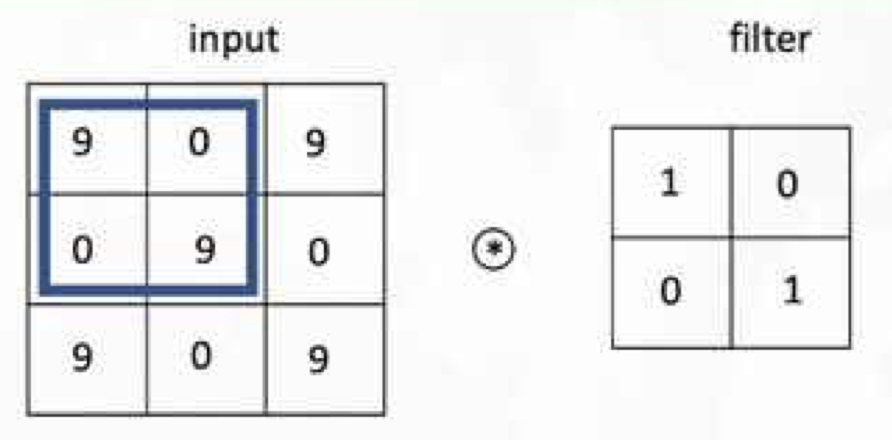
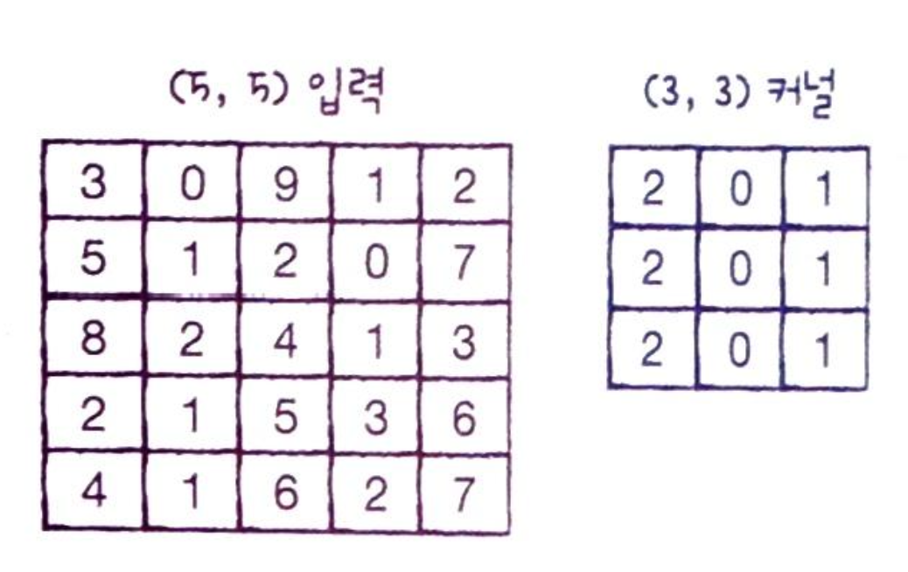
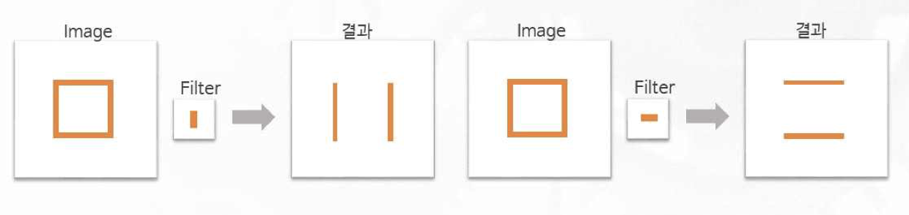
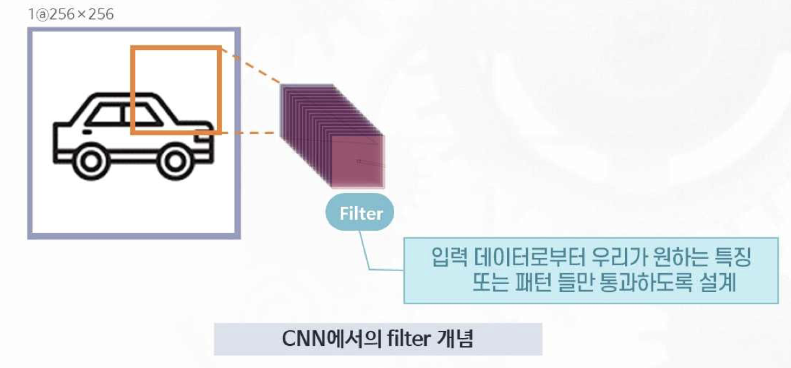
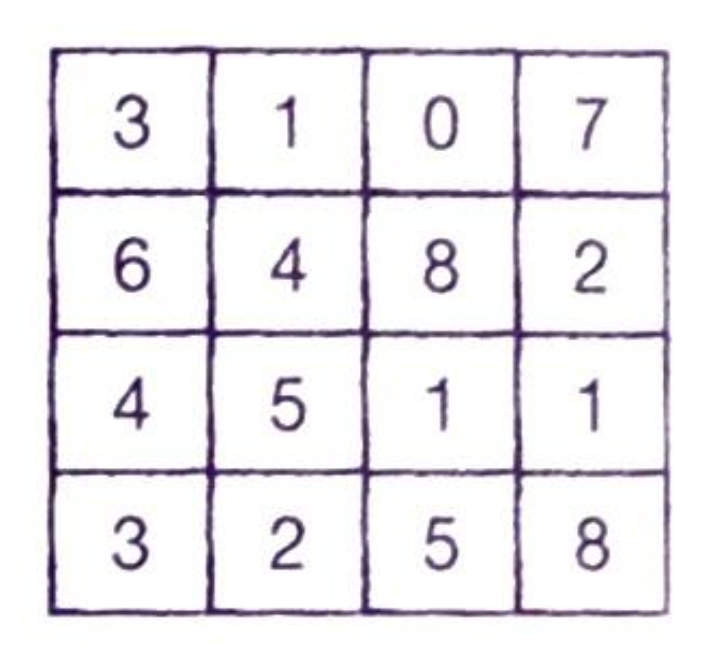
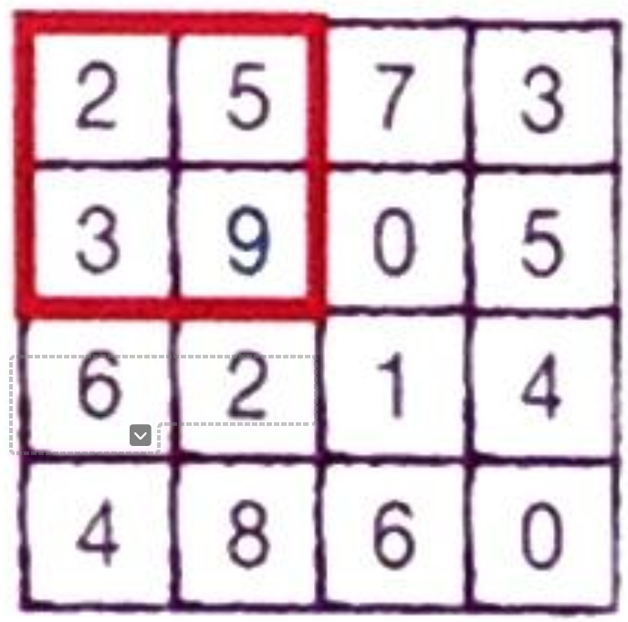
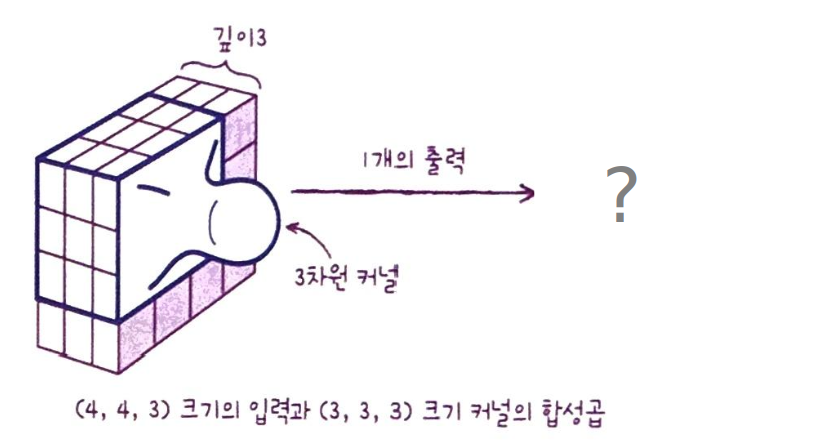
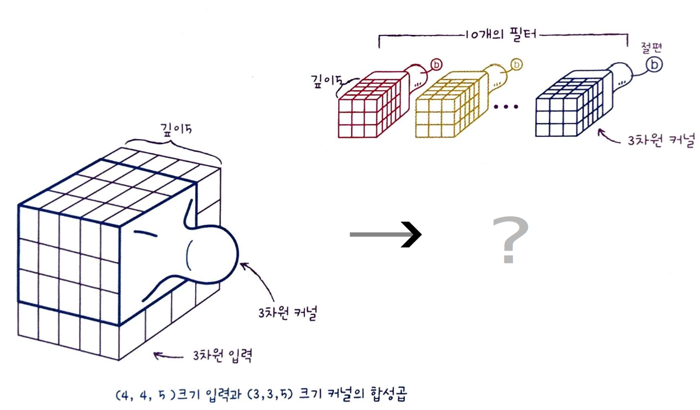

<grid drag="100 3" drop="0 5" bg="#555555">
ML Study<!-- element style="font-size:13pt;color:white;"pad="10px" -->
</grid>

<grid drag="100 50" drop="0 20">
# 합성곱 신경망의 구성요소
</grid>
<grid drag="100 5" drop="0 70" >

컴퓨터교육과 정솔  
2024.06.03.(화)

</grid>

---
## 합성곱 신경망 (Convolution NN)

### 학습 목표
* 정의 : **필터(Filter)**, 특성맵(Feature map), 패딩(Padding), 스트라이드(Stride)
* 과정 : **합성곱(Convolution) 연산**, 풀링(Pooling) 연산
* 합성곱 신경망의 과정을 이해하고 필요성을 설명할 수 있다.

---

## 합성곱 신경망의 연산 
### **예제1** 다음과 같은 input과 filter가 주어졌을 때 특성맵을 계산하시오. (단, stride = (1, 1))

### **문제1** 다음과 같은 input과 filter가 주어졌을 때 특성맵을 계산하시오. (단, stride = (2, 2))
<!-- element style="margin-top:-20px;"-->

---
## 합성곱 연산과 필터의 역할

<!-- element style="margin-top:-20px;"-->

---
## 패딩Padding 
input의 배열 주위를 가상의 원소로 채우는 것 (주로 0)

### 필요성
패딩이 없다면 모서리와 가운데 입력값이 연산에 반영되는 횟수에 차이가 나게 됨

### 패딩의 종류
* Vaild : 패딩 안함 (기본값)
* Same : 입력과 특성맵이 같은 모양의 배열이 되도록 0을 패딩

---

### **예제2** 다음 input에 (2, 2) filter가 주어졌을 때 Same padding을 하기 위한 방법은?
#### +) Padding 전후 모서리의 원소들이 연산에 참여하는 횟수 비교

---
## 풀링Pooling
특성맵의 주어진 크기의 구획에서 가장 큰 값을 고르거나 평균값을 계산하여 가로세로 크기를 줄이는 연산
### 종류 : 최대 풀링, 평균 풀링
### 예제3 다음 특성맵에서 (2, 2) 최대 풀링을 적용한 결과는?

---

<grid drag="100 20" drop="0 5">
## 컬러 이미지를 사용한 합성곱 (3차원 input과 3차원 kernel)
### 케라스의 합성곱의 입력 : 3차원배열 (1차원일 경우 변환)
</grid>

<grid drag="30" drop="4 30" >
### 경우1 

</grid>

<grid drag="30" drop="50 30" >
### 경우2

</grid>

---

# 감사합니다
