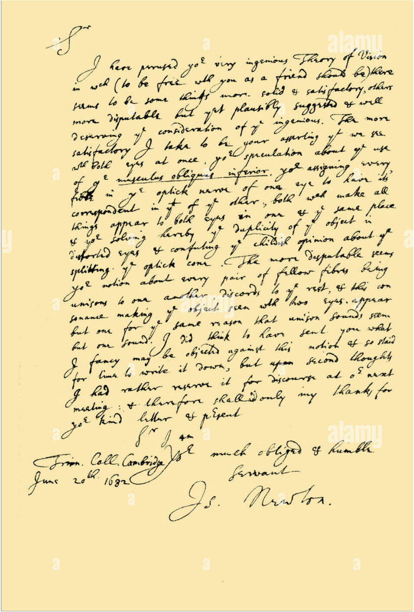
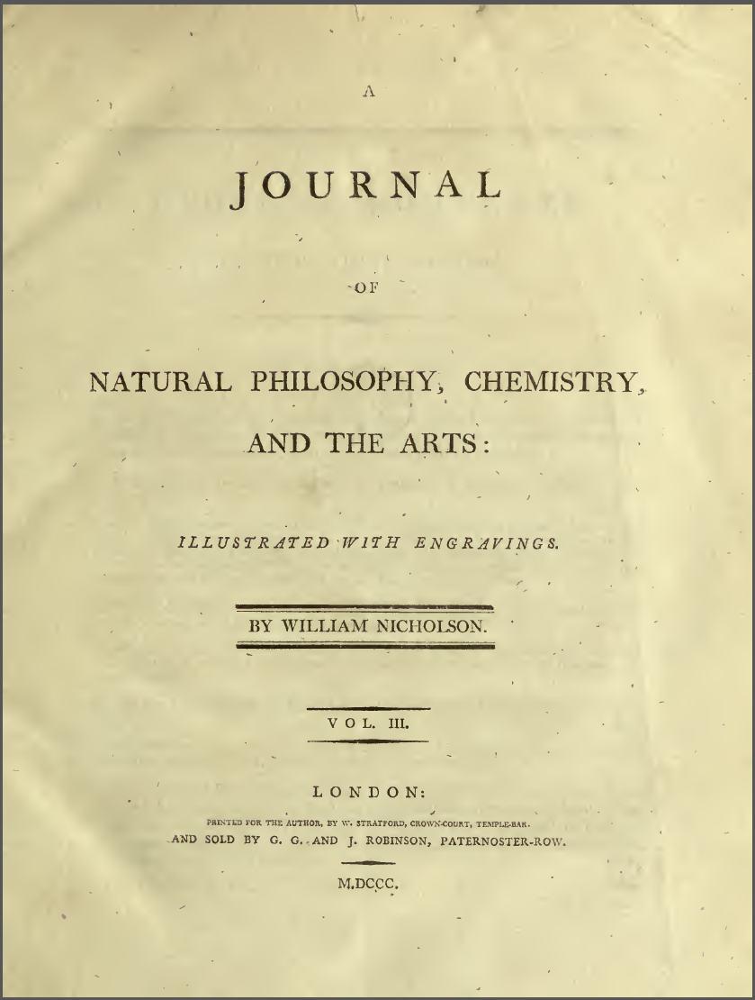

<grid drag="100 3" drop="0 5" bg="#555555">
랩세미나<!-- element style="font-size:13pt;color:white;"pad="10px" -->
</grid>

<grid drag="100 50" drop="0 20">
# 학술논문작성법 : KOOC 강의 요약정리
</grid>
<grid drag="100 5" drop="0 70" >

 컴퓨터교육과 정솔  
2024.05.22 (수) 

</grid>

---

<grid drag="46 100" drop="5 5">
## 1. Why Write a Paper?
### 새로운 지식의 전파
#### 페이퍼 시스템의 원형
* 새로운 지식을 담은 책 출간, 편지 교환
* 문제점 : 오래 걸림, 폐쇄적, 검증시스템 부재

#### 과학 저널 시스템 도입 (17세기 영국)
* 연구 결과 투고 - 전문가 검토 시스템 확립
</grid>

<grid drag="55 100" drop="45 5" >
<split even gap="1">

</split>
</grid>

---
