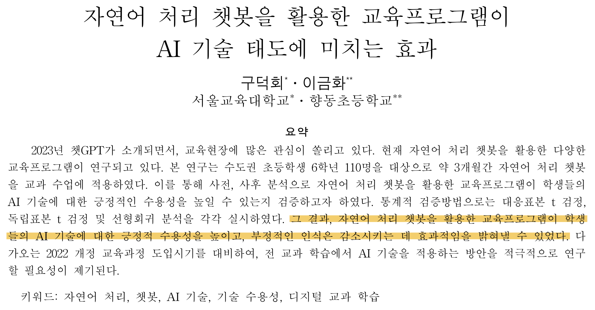
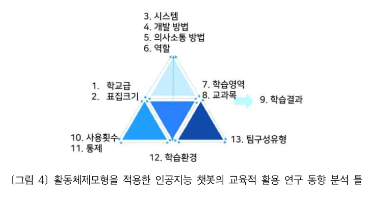
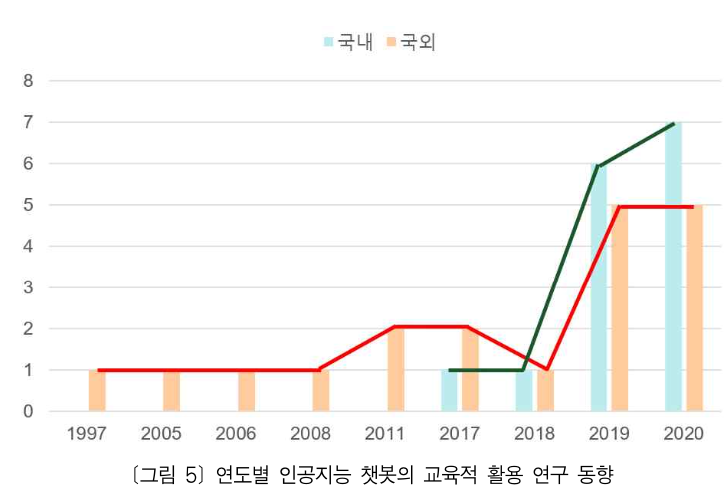
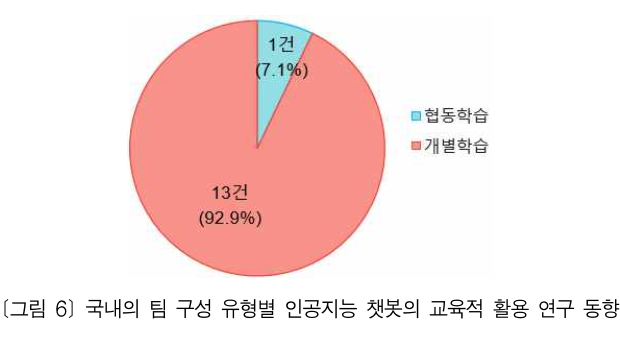
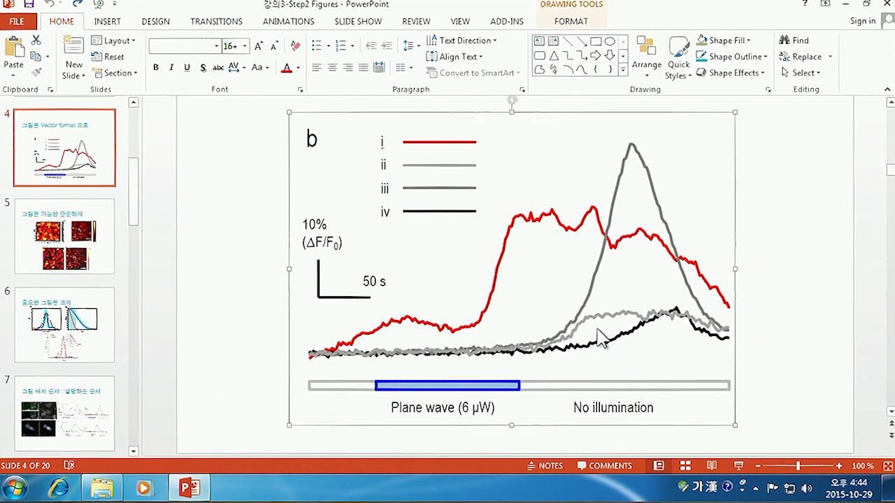
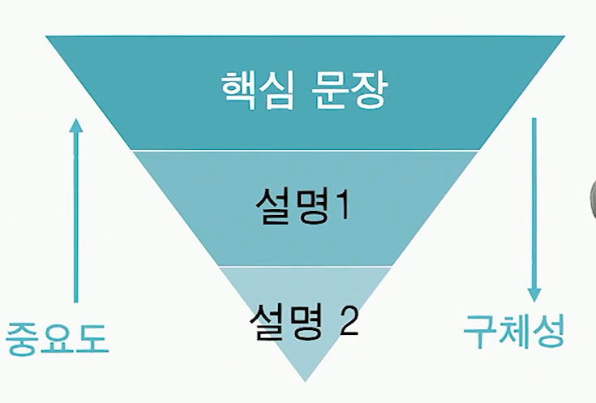
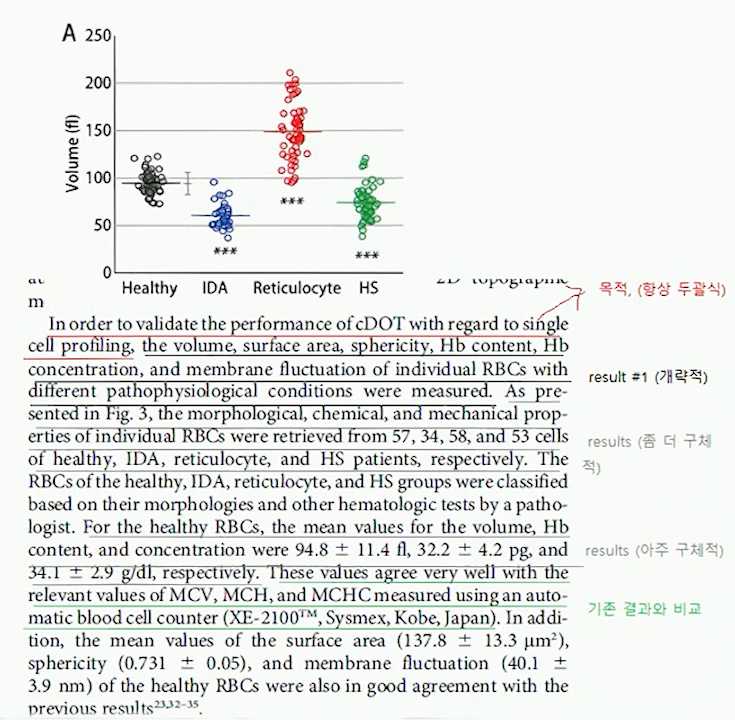
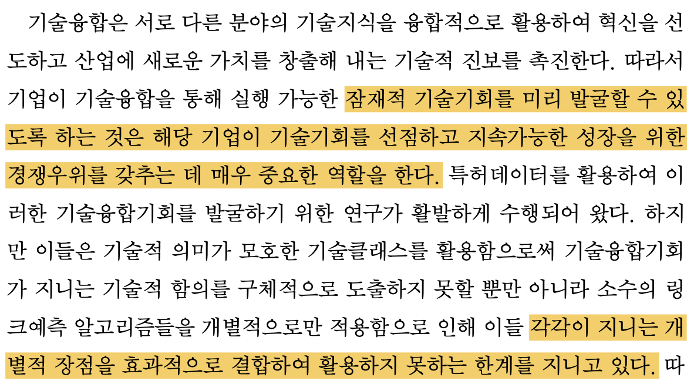
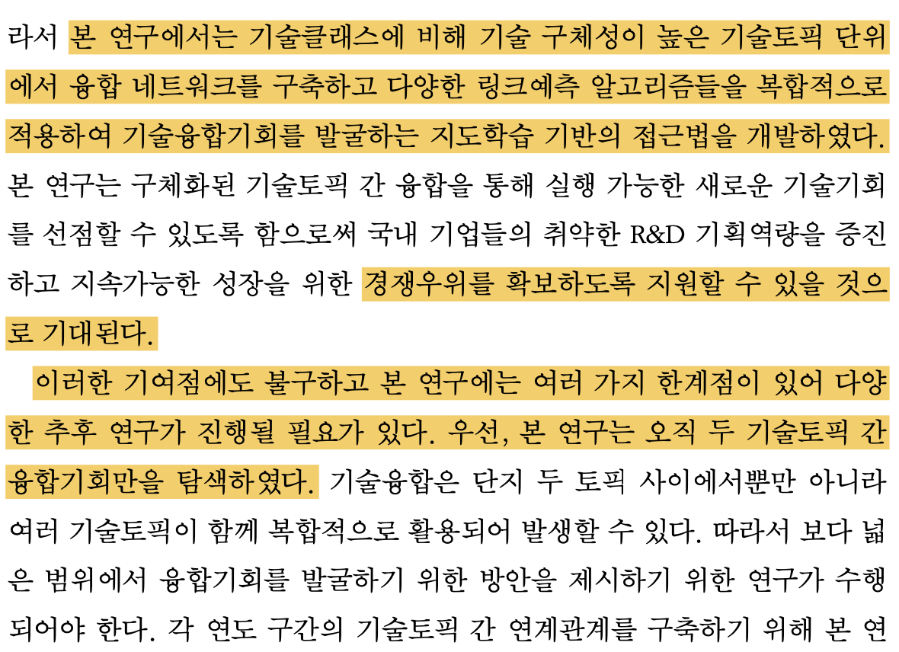

<grid drag="100 3" drop="0 5" bg="#555555">
Lab Seminar<!-- element style="font-size:13pt;color:white;"pad="10px" -->
</grid>

<grid drag="100 50" drop="0 20">
# 학술논문작성법 (KAIST, 박용근 교수님)

</grid>
<grid drag="100 5" drop="0 70" >


<center> 컴퓨터교육과 정솔 <br>
2024.05.22 (수) </center>
</grid>


---
## 효과적인 논문 작성 순서




---


<grid drag="46 100" drop="10 5">
## Basic Structure 1 : 결론
* 한 문장으로 요약할 수 있는 연구의 **핵심**  <br>:  새로 알아낸 가치있는 결과
* 결론을 먼저 쓰고 논문을 작성 <br>: 결론을 상기하며 일관성유지
* 핵심어 + 핵심어 + 핵심어
</grid>

<grid drag="46 100" drop="50 5" >

</grid>

---


<grid drag="100 20" drop="0 5">
## Basic Structure 2 : 구성
</grid>

<grid drag="46" drop="0 20" >

### 논문의 구성 짜기
: 결론에 가장 잘 도달하도록!<!-- element style="margin-top:-10px" -->
* 원리 : 이 방법의 원리가 어떤 것이냐면 $\cdots$
* 실험1 + 결과1 : 그래서 실험1을 해보았더니 결과1이 나왔는데 
* 논의 1 : 이 결과는 이런 의미라서 중요하고
* 저런 경우에도 되는 지 보기 위해 실험 2를 해보니
* 결과 2가 나왔는데
* 이 결과가 왜 말이 되느냐면 기존 논문에 의하면 / 이론적으로 계산해보면 / 검증해보면 $\cdots$

</grid>

<grid drag="46" drop="50 20" >
### 논문의 구성은 그림으로
: 제목과 그림만 보고 이해할 수 있는 논문이 효과적<!-- element style="margin-top:-10px;margin-bottom:-10px" -->
* 그림 1 : 원리<br>
  <!-- element style="margin-top:-10px;margin-bottom:-10px" -->

* 그림 2 : 결과1
  <!-- element style="margin-top:-10px;margin-bottom:-10px" -->
  
* 그림 3 : 결과 2
  <!-- element style="margin-top:-10px" -->


</grid>


---
## 그림 Figures

* 똑같은 내용이라도 좋은 그림을 쓰면 논문의 퀄리티가 높아짐
* 내용을 효과적으로 전달하기 위한 그림과 배치를 고민 (ex. 중요한 그림은 크게)

### 논문 그림 작업도
<!-- element style="align-self:start;margin-left:50px"-->

---

### PowerPoint를 이용한 그림 관리와 벡터이미지 수정

* matplotlib to svg $\phantom{xxxxxxxx}$
```python
  # plt : matplot figure
  plt.savefig("filename.svg")
```
* insert
* modify
* export as image(svg, tiff)

<grid drag="" drop="40 35"> 

</grid>

---


<grid drag="46 100" drop="5 5">
## 결과 Results
* 그림(또는 표)의 결과를 빠짐없이 논리적으로 설명
* 하나의 문단에는 하나의 내용만 담을 것
* 문단은 항상 두괄식으로<br>
  
* 문단 내 논리 흐름<br> ```mermaid
graph LR
A[Narrative Explanation];
B[Justification];
C[Logical Development];
A --> B;
B --> C;
```

</grid>

<grid drag="46 100" drop="50 5" >

</grid>


---


<grid drag="100 20" drop="0 5">
## 논의 및 결론 Discussion & Conclusion
</grid>

<grid drag="46" drop="4 20" >
### 결과 $\rightarrow$ 결론 논리 흐름
### 논의 및 결론의 내용
* 연구의 중요성 <br><span class="src">장점 강조는 구체적으로</span>
* 새로 알게된 결과 <br><span class="src">기존 연구 대비 significant advance가 있음을 강조</span>
* 연구 결과로 인한 전망 및  의의
* 연구의 한계 <br><span class="src">Reviewer가 공격할 약점을 미리 언급<br>대안/보충설명으로 보완</span>
</grid>

<grid drag="46" drop="50" >

<!--element style="margin-top:-27px"-->
</grid>


---

### 논문 작성시 유의사항
1. 쉬운 단어로 쉽게 설명 <br><span class="src">표현은 쉽게 내용은 깊게</span>
2. 독자의 입장에서 고민 <br><span class="src">논리 흐름, 제기될 수 있는 의문 고려</span>
3. 비중과 위치로 중요한 부분을 강조
4. 모든 과정과 결과를 논문에 다 넣을 필요 없음<br><span class="src">사소한 점을 장황하게 쓰거나 얼마나 고생했는지 표현하려고 하지 마라</span>

---

# 감사합니다